### Python Challenge

The main website is [here](http://www.pythonchallenge.com), and the first problem is [here](http://www.pythonchallenge.com/pc/def/0.html).  All the urls have the form

```
http://www.pythonchallenge.com/pc/def/0.html
```

#### Problem 1

The specific part of the url here is `0`:  [link](http://www.pythonchallenge.com/pc/def/0.html).

The page we obtain looks like this:


Often we will need to look at the source of a web page (though not for this problem).  A simplified approach ignores issues of user-agent (anti-bot techniques).  We have

**load_url.py**

```
import sys, urllib2

url = sys.argv[1]

req = urllib2.Request(url)
response = urllib2.urlopen(req)
page = response.read()
response.close()
print page
```

In this case

```
> python load.py http://www.pythonchallenge.com/pc/def/0.html
<html>
<head>
  <title>warming up</title>
  <link rel="stylesheet" type="text/css" href="../style.css">
</head>
<body>
<center>
<br>
<font color="gold">
<p>Hint: try to change the URL address.
</body>
</html>

>
```

There is a title, which was not displayed in my browser, a file name for the image, and the hint, which was shown.

We simply calculate

```
>>> 2**38
274877906944
>>>
```

#### Problem 1

The specific part of the url is `274877906944`.

```
http://www.pythonchallenge.com/pc/def/274877906944.html
```

We obtain


```
K -> M
O -> Q
E -> G
```

At the bottom of the page is this text:

```
g fmnc wms bgblr rpylqjyrc gr zw fylb. rfyrq ufyr amknsrcpq ypc dmp.
bmgle gr gl zw fylb gq glcddgagclr ylb rfyr'q ufw rfgq rcvr gq qm jmle. 
sqgle qrpgle.kyicrpylq() gq pcamkkclbcb.
lmu ynnjw ml rfc spj.
```

which I've taken the liberty of reformatting with a couple of newlines.  In the page source the title says:

```
<title>What about making trans?</title>
```

So the `string` module has `maketrans`.  It's pretty clear that this is a Caesar cipher.

**1.py**

```
from utils import load
from string import maketrans

s1 = load('1.txt')
tr = maketrans('abcdefghijklmnopqrstuvwxyz',
               'cdefghijklmnopqrstuvwxyzab')
              
s2 = s1.translate(tr)
print s2

s3 = 'map'
print s3.translate(tr)

# ocr
```

**output:**  (also reformatted slightly)

```
> python 1.py
i hope you didnt translate it by hand. 
thats what computers are for. 
doing it in by hand is inefficient and that's why this text is so long. 
using string.maketrans() is recommended. 
now apply on the url.
ocr
>
```

Belatedly we notice that the url we requested was `274877906944`, but what we received says `map`.  The translation of `map` is `ocr`.

#### Problem 2

The specific part of the url is `ocr`:  [link](http://www.pythonchallenge.com/pc/def/ocr.html).

```
http://www.pythonchallenge.com/pc/def/ocr.html
```

We obtain

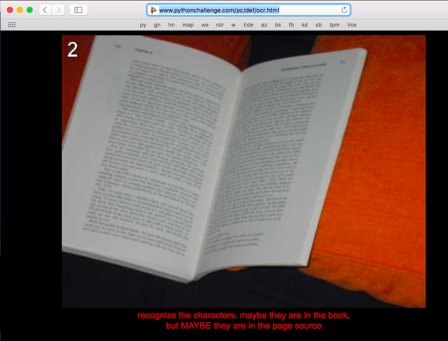

The hint:

```
recognize the characters. maybe they are in the book, 
but MAYBE they are in the page source.
```

directs us to the page source which is a lot of stuff like [2.txt](data/2.txt).  We screen out the commonly occurring characters.

```
from utils import load
data = load('2.txt')

bad = '!@#$%^&*()[]{}+_- '
L = [c for c in data if not c in bad]
L = [c for c in L if not c == '\n']
print ''.join(L)
```

```
> python 2.py 
equality
```

What is left is one word:  `equality`.

#### Problem 3

The specific part of the url is `equality`:  [link](http://www.pythonchallenge.com/pc/def/equality.html)

We obtain

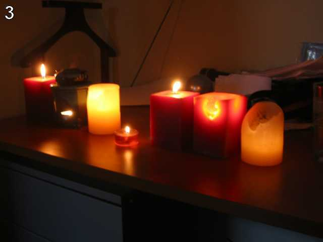

and the text of the hint is

```
One small letter, surrounded by EXACTLY three big bodyguards on each of its sides.
```

We use `load_url` to obtain the page source.  It looks like: [3.txt](data/3.txt).

So it's pretty clear that we're looking for a lower case letter preceeded and followed by a run of three capitals.  This is a job for the `re` module (which is what the part of the source that I stripped out hints to do).

**3.py**

```
from utils import load
from string import letters as lt

data = load('3.txt')

import re
s = '[a-z]'
S = '[A-Z]'
sL = [s,S,S,S,s,S,S,S,s]
p = re.compile(''.join(sL))
L = p.findall(data)
print ''.join(L)
```

**output**

```
> python 3b.py
['qIQNlQSLi', 'eOEKiVEYj', 'aZADnMCZq', 'bZUTkLYNg', 'uCNDeHSBj', 'kOIXdKBFh', 'dXJVlGZVm', 'gZAGiLQZx', 'vCJAsACFl', 'qKWGtIDCj']
>
```

So then we grab each of the small letters:  `linkedlist`.  That's our next url.

#### Problem 4

The specific part of the url is `linkedlist`:  [link](http://www.pythonchallenge.com/pc/def/linkedlist.html)

We obtain some bare text: 

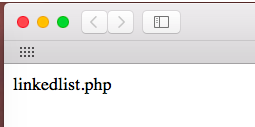

so change the url to end with `php` (another scripting language):

[link](http://www.pythonchallenge.com/pc/def/linkedlist.php)

we get this:


The picture doesn't help me much at first.  

But there is a hint in the source.  The title says:  follow the chain.

```
python load_url.py http://www.pythonchallenge.com/pc/def/linkedlist.php
...
  <title>follow the chain</title>
...
<!-- urllib may help. DON'T TRY ALL NOTHINGS, since it will never 
end. 400 times is more than enough. -->
...
```

And the jpg is actually a `href`

```a href="linkedlist.php?nothing=12345"> 400:
        break
    n = get(n)
```

```
355 75635
356 52899
357 66831
358 peak.html
359 72758
360 71301
361 55577
362 88786
```

`peak.html` is our next url.

#### Problem 5

The specific part of the url is `peak`:  [link](http://www.pythonchallenge.com/pc/def/peak.html)

The hint says "pronounce it".


Pronounce what?  For that we need the page source.

```
> python load_url.py http://www.pythonchallenge.com/pc/def/peak.html
<html>
<head>
  <title>peak hell</title>
  <link rel="stylesheet" type="text/css" href="../style.css">
</head>
<body>
<center>

<br><font color="#c0c0ff">
pronounce it
<br>
<peakhell src="banner.p"/>
</body>
</html>

<!-- peak hell sounds familiar ? -->
```

The title is "peak hell".  That does sound like a python module:  `pickle`.

I have to confess that at this point I got stuck.  I knew I had to use the pickle module to pickle or un-pickle something.

But what?  The jpg?  Nooooh.  The clue is this line

```
<peakhell src="banner.p"/>
```

Putting that in the url gives:

```
(lp0
(lp1
(S' '
p2
I95
tp3
...
```

There's a nother hint---that word "banner".

Save the data to a file: [5b.txt](data/5b.txt).

**5.py**

```
import pickle

fn = open('5b.txt', 'rb')
p = pickle.load(fn)
for line in p:
    print line
```

```
> python 5.py
[(' ', 95)]
[(' ', 14), ('#', 5), (' ', 70), ('#', 5), (' ', 1)]
[(' ', 15), ('#', 4), (' ', 71), ('#', 4), (' ', 1)]
[(' ', 15), ('#', 4), (' ', 71), ('#', 4), (' ', 1)]
[(' ', 15), ('#', 4), (' ', 71), ('#', 4), (' ', 1)]
[(' ', 15), ('#', 4), (' ', 71), ('#', 4), (' ', 1)]
[(' ', 15), ('#', 4), (' ', 71), ('#', 4), (' ', 1)]
[(' ', 15), ('#', 4), (' ', 71), ('#', 4), (' ', 1)]
[(' ', 15), ('#', 4), (' ', 71), ('#', 4), (' ', 1)]
```

With "banner" as the clue, we guess that we should print a banner.  The second line is 

```
              ##### ...
```

14 ` ` (spaces) followed by 5 `#`.

And so on:

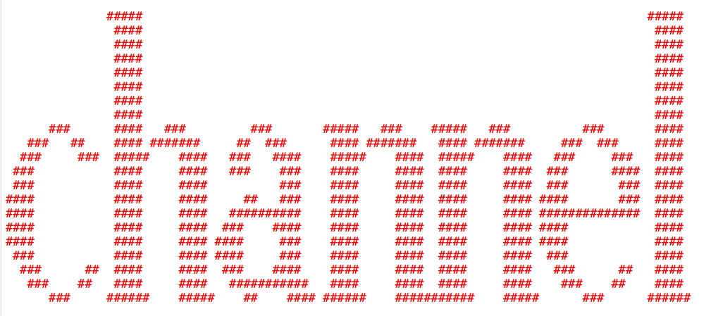

#### Problem 6

The specific part of the url is `channel`:  [link](http://www.pythonchallenge.com/pc/def/channel.html)


Looks like a Rolling Stones album [cover](https://en.wikipedia.org/wiki/Sticky_Fingers).  The wikipedia is not as risque as what I have in my collection of vinyl.

The page [source](data/6.txt) has 

```
<html> <!-- <-- zip -->
<head>
  <title>now there are pairs</title>
```

I guess we're supposed to use the Python `zip` module to unzip something, but what?

Substituting `zip` into the url gives

```
yes. find the zip.
```

and that is all.  Nothing else in the source.

Once again I got stuck and looked for help on the internet.  Silly.  We do what we've done before, replace part of the url.  This time we replace the **suffix**:

```
http://www.pythonchallenge.com/pc/def/channel.zip
```

[link](http://www.pythonchallenge.com/pc/def/channel.zip)

We have downloaded a zip file.  It seems clear we should use the Python zipfile module to examine this.

```
import zipfile
z = zipfile.ZipFile('channel.zip')
print z.open('readme.txt').read()
```

Unzipping by hand reveals a `readme.txt`.  We construct a ZipFile object as shown and print what it says:

```
> python 6.py 
welcome to my zipped list.

hint1: start from 90052
hint2: answer is inside the zip
```

If we examine `90052.txt` it just says:  `Next nothing is 94191`.  So we have another linked list to follow.

```
L = list()

def follow(fn):
    fn += '.txt'
    L.append(fn)
    fh = z.open(fn)
    result = fh.read()
    return result.strip().split()[-1]

def run():
    fn = '90052'
    for i in range(1000):
        fn = follow(fn)
        if fn == 'comments.':
            break
        # print i, fn

run()
```

We follow the chain and at the same time save all the file names.  Item 907 is `46145.txt`, which has another hint:  "Collect the comments."

So we go over the list of filenames and collect the comments from ZipInfo objects

```
cL = list()
for fn in L:
    info = z.getinfo(fn)
    cL.append(info.comment)
print ''.join(cL)
```

and print the result

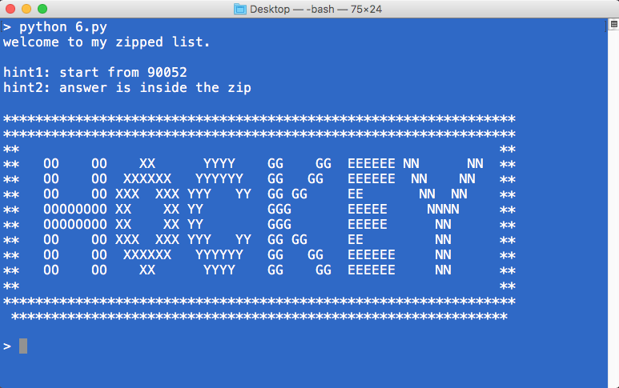


#### Problem 7

The specific part of the url is `hockey`:  [link](http://www.pythonchallenge.com/pc/def/hockey.html)

which returns this text:

```
it's in the air. look at the letters.
```

The url has not been altered.  The page source has nothing extra.  I notice the letters in previous figure:

The specific part of the url is `oxygen`:  [link](http://www.pythonchallenge.com/pc/def/oxygen.html)


which returns [7.txt](7.txt), and that shows only the title:  "smarty".  That gives a 404 when substituted in the url.

So what about the picture?  Notice it has a strip across the middle.  Each unit of the strip is 7 pixels wide, except the first, with 5, and the last, with 8.  The strip starts at row 43, and the image is 629 x 95.  So the data should start around 27047 (x 3) or `0x13cf5`

There is a Python png [module](https://pypi.python.org/pypi/pypng).  I didn't have it so `pip install pypng`.

```
>>> import png
>>> r = png.Reader('oxygen.png')
>>> r
<png.Reader instance at 0x1063dc998>
>>> r.read()
(629, 95, <itertools.imap object at 0x10644d7d0>, {'bitdepth': 8, 'interlace': 0, 'background': (0, 0, 0), 'planes': 4, 'greyscale': False, 'alpha': True, 'size': (629, 95)})
>>> L = list(r.read()[2])
```

The image has a bit depth of 8.  It is not greyscale, and it does have alpha (transparency).  Looking at the data, every 4th value is 255.

Each row in L is a tuple of ('B', sL) where sL is an arrray of ints (0..255).

```
>>> sL = L[44]
>>> for i in range(0,len(sL),4):
...     print sL[i:i+4]
... 
array('B', [115, 115, 115, 255])
array('B', [115, 115, 115, 255])
array('B', [115, 115, 115, 255])
array('B', [115, 115, 115, 255])
array('B', [115, 115, 115, 255])
array('B', [115, 115, 115, 255])
array('B', [109, 109, 109, 255])
array('B', [109, 109, 109, 255])
array('B', [109, 109, 109, 255])
array('B', [109, 109, 109, 255])
array('B', [109, 109, 109, 255])
array('B', [109, 109, 109, 255])
array('B', [109, 109, 109, 255])
array('B', [97, 97, 97, 255])
array('B', [97, 97, 97, 255])
...
```

I started collecting these (by hand because of the irregular spacing):

```
115,109,97,114,116,32,103,117,44,32,121,111,117,32
109,97,100,101,32,105,116,46,32,116,104,101,101,32
110,101,120,116,32,108,101,118,101,108,32,105,115,32
91,49,48,53,44,32,49,49,48,44,32,49,
```

but I grew tired of it.  

```
>>> ssL = [sL[i] for i in range(0,len(sL),4)]
>>> ssL
[115, 115, 115, 115, 115, 109, 109
```

I collected every 4th value, and then of those, I collect every 7th value:

```
>>> pL = [ssL[i] for i in range(0, len(ssL), 7)]
>>> pL
[115, 109, 97, 114, 116, 32,
```

Note the repeated values of 32 indicate spaces in ASCII.

```
>>> cL = [chr(n) for n in pL]
>>> ''.join(cL)
'smart guy, you made it. the next level is [105, 110, 116, 101, 103, 114, 105, 116, 121]wr\\'
>>> 
```

```
>>> aL = [105, 110, 116, 101, 103, 114, 105, 116, 121]
>>> ''.join([chr(n) for n in aL])
'integrity'
>>>
```

#### Problem 8

The specific part of the url is `integrity`:  [link](http://www.pythonchallenge.com/pc/def/integrity.html)

which returns this image:


with the title "working hard?"

Clicking the image gives a login screen:

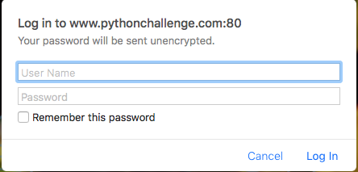

The page source is [here](data/8.txt).

It includes:

```
<map name="notinsect">
...
<area shape="poly"
coords="179,284,214,311 ...
href="../return/good.html" />
...
<font color="#303030" size="+2">Where is the missing link?</font>
...
<!--
un: 'BZh91AY&SYA\xaf\x82\r\x00\x00\x01\x01\x80\x02\xc0\x02\x00 \x00!\x9ah3M\x07<]\xc9\x14\xe1BA\x06\xbe\x084'
pw: 'BZh91AY&SY\x94$|\x0e\x00\x00\x00\x81\x00\x03$ \x00!\x9ah3M\x13<]\xc9\x14\xe1BBP\x91\xf08'
-->
```

Pasting in `/return/good.html` [link](http://www.pythonchallenge.com/pc/def/return/good.html) gives a 404.

We have some hints 

* "notinsect"
* "where is the missing link?"
* a username and password 

Pressing the image of the bee? generates "/return/good.html" which then gives the login screen.

The username and password are, however, in binary.

```
import requests

EMAIL = 'BZh91AY&SYA\xaf\x82\r\x00\x00\x01\x01\x80\x02\xc0\x02\x00 \x00!\x9ah3M\x07<]\xc9\x14\xe1BA\x06\xbe\x084'
PASSWORD = 'BZh91AY&SY\x94$|\x0e\x00\x00\x00\x81\x00\x03$ \x00!\x9ah3M\x13<]\xc9\x14\xe1BBP\x91\xf08'
URL = 'http://www.pythonchallenge.com/pc/return/good.html'

session = requests.session()

login_data = dict(username=EMAIL, password=PASSWORD)
r = session.post(URL, data=login_data)
print r.content
```

gives a 401 Unauthorized.  The "b" could be for base64.

```
>>> import base64 as b64
>>> s = 'BZh91AY&SYA\xaf\x82\r\x00\x00\x01\x01\x80\x02\xc0\x02\x00 \x00!\x9ah3M\x07<]\xc9\x14\xe1BA\x06\xbe\x084'
>>> b64.b64encode(s, 'utf-8')
'QlpoOTFBWSZTWUGvgg0AAAEBgALAAgAgACGaaDNNBzxdyRThQkEGvgg0'
>>> t = 'BZh91AY&SY\x94$|\x0e\x00\x00\x00\x81\x00\x03$ \x00!\x9ah3M\x13<]\xc9\x14\xe1BBP\x91\xf08'
>>> b64.b64encode(t, 'utf-8')
'QlpoOTFBWSZTWZQkfA4AAACBAAMkIAAhmmgzTRM8XckU4UJCUJHwOA=='
>>> 
```

These do not work, but they lead to progress.  I did a web search for `BZh91AY&SY` and found [this](http://effbot.org/librarybook/bz2.htm) about the `bz2` module---matching our "insect".

It's in an example:

```
>>> import bz2
>>> msg = "the meaning of life"
>>> cmsg = bz2.compress(msg)
>>> print repr(cmsg)
'BZh91AY&SY\xcb\x18\xf4...'
>>>
```

So it's a header for `bz2` compressed messages.

```
>>> import bz2
>>> s = 'BZh91AY&SYA\xaf\x82\r\x00\x00\x01\x01\x80\x02\xc0\x02\x00 \x00!\x9ah3M\x07<]\xc9\x14\xe1BA\x06\xbe\x084'
>>> bz2.decompress(s)
'huge'
>>> t = 'BZh91AY&SY\x94$|\x0e\x00\x00\x00\x81\x00\x03$ \x00!\x9ah3M\x13<]\xc9\x14\xe1BBP\x91\xf08'
>>> bz2.decompress(t)
'file'
>>> 
```

Our login credentials get us in

```
import requests

EMAIL =    'huge'
PASSWORD = 'file'
URL = 'http://www.pythonchallenge.com/pc/return/good.html'

session = requests.session()

login_data = dict(username=EMAIL, password=PASSWORD)
r = session.post(URL, data=login_data)
print r.content
```

#### Problem 9

The specific part of the url is `integrity`:  [link](http://www.pythonchallenge.com/pc/def/return/good.html)

which returns this image:

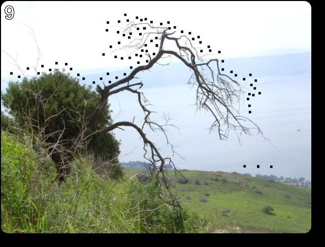

An uprooted tree with some little blocks in it.

I cannot look at the source with `load_url.py`.  I get a 401: Unauthorized.

The `requests` module doesn't work either.

The title says:  connect the dots.  Not those dots!

However, using Show Page Source in Safari does work:  [9.txt](data/9.txt).

Looking on the web again, I find the right hint:  The numbers are pairs of coordinates:  `x1, y1, x2, y2 ...` in two different blocks.  I should have been able to figure that out.

This calls for `matplotlib`.

```
pip install matplotlib
```

(using my brew-installed Python).

**9.py**

```
import matplotlib.pyplot as plt

fn = 'data/9.txt'
fh = open(fn)
data = fh.read()
fh.close()

blocks = data.strip().split('\n\n')

def get_ints(s):
    values = s.strip().split(':')[1].strip()
    L = values.split(',')
    return [int(s) for s in L]

first = get_ints(blocks[1])
second = get_ints(blocks[2])

for i in range(0,len(first),2):
    x,y = first[i:i+2]
    plt.scatter(x,y,c ='k')

for i in range(0,len(second),2):
    x,y = second[i:i+2]
    plt.scatter(x,y,c ='r')

plt.savefig('figs/saved.png')
```

It's upside down, but the result is clearly a cow or, perhaps, a bull.

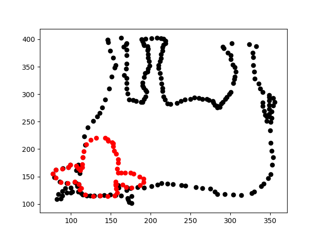

#### Problem 10

The specific part of the url is `bull`:  [link](http://www.pythonchallenge.com/pc/def/return/bull.html)

which returns this image:

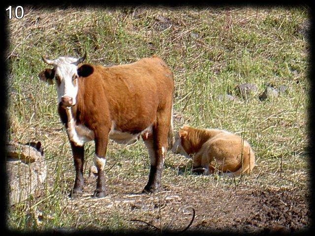

The title says: `what are you looking at?`

The text says `len(a[30]) = ?`

The page source says: `<area shape="poly" coords="146,399`

So this'll be another link.  Push it.  The bull.

```
a = [1, 11, 21, 1211, 111221, 
```

So this is a sequence.  What is the formula?

I couldn't figure it out.  

But I found it's a famous [sequence](https://edublognss.wordpress.com/2013/04/16/famous-mathematical-sequences-and-series/) in math.

It's called the "look-and-say" sequence:

```
1 = "one 1" = 11
11 = "two 1" = 21
21 = "one 2 one 1" = 1211
1211 = "one 1 one 2 two 1" = 111221
```

**10.py**

```
def get_reps(s):
    L = [[1,s[0]]]
    for c in s[1:]:
        if c == L[-1][1]:
            L[-1][0] += 1
        else:
            L.append([1,c])            
    rL = list()
    for e in L:
        rL.append(str(e[0]))
        rL.append(e[1])
    return ''.join(rL)

curr = '1'
L = [curr]
for i in range(30):
    next = get_reps(curr)   
    curr = next
    L.append(curr)
    
print L[:5]
print len(L[30])
```

**output**

```
> python 10.py 
['1', '11', '21', '1211', '111221']
5808
>
```

We need to stay logged in [link](http://www.pythonchallenge.com/pc/def/integrity.html).  Then go [here](http://www.pythonchallenge.com/pc/return/bull.html) and correct the url.

#### Problem 11

The specific part of the url is `5808`:  [link](http://www.pythonchallenge.com/pc/return/5808.html)

which returns this image:


The title says "odd even".  There is nothing interesting in the source.  On magnification it looks like there are two images mixed together.  Perhaps all the even pixels are one and the odds, another.

I used to use `PIL` to work with images.  Anything else?  We used `pypng` above.  PIL is pretty old.  According to this [page](http://python-guide-pt-br.readthedocs.io/en/latest/scenarios/imaging/), there is something called Pillow.

I played with Pillow, but it isn't giving me the data I expect in the final jpg.

According to the PIL [docs](http://effbot.org/zone/pil-changes-116.htm), just do this:

```
from PIL import Image
import numpy
im = Image.open('cave.jpg')
L = list(im.getdata())
print L[:5]
print L[-5:]
```

```
> python 11.py 
[(0, 20, 0), (142, 180, 105), (0, 20, 0), (139, 177, 100), (0, 20, 0)]
[(1, 7, 0), (131, 137, 89), (1, 7, 0), (126, 132, 84), (1, 7, 0)]
>
```

These are tuples of RGB in a flat list.  We can convert to a numpy array like this:

```
a = numpy.array(im)
```

print gives

```
> python 11.py 
[[[  0  20   0]
  [142 180 105]
  [  0  20   0]
  ..., 
  [ 88 113  83]
  [  0  13   0]
  [ 92 117  87]]

 [[148 186 111]
  [  0  20   0]
  [148 186 109]
  ..., 
  [  0  14   0]
  [ 87 112  82]
  [  0  12   0]]

 [[  0  20   0]
  [158 195 118]
  [  0  20   0]
  ..., 
  [ 90 115  85]
  [  0  18   0]
  [ 90 115  85]]

 ..., 
 [[154 135  95]
  [ 20   0   0]
  [155 133  94]
  ..., 
  [  8  14   0]
  [129 135  87]
  [  1   7   0]]

 [[ 28   6   0]
  [167 145 106]
  [ 20   0   0]
  ..., 
  [124 130  82]
  [  1   7   0]
  [125 131  83]]

 [[162 140  99]
  [ 24   2   0]
  [172 150 109]
  ..., 
  [  1   7   0]
  [126 132  84]
  [  1   7   0]]]
>
```

which matches.  So now the question is how to get the odd numbered values from the even numbered rows and vice-versa.

I don't know how to write the correct expression to do this in numpy.  But if we work with the flat list, we can just pick every other value.

To show that we have the capability to pull this off:

```
from PIL import Image
import numpy as np

im = Image.open('Lena.jpg')
L = list(im.getdata())
a = np.array(im)
t = a.shape

b = np.array( L, dtype='uint8')
b.shape = t
im2 = Image.fromarray(a)
im2.save('Lena2.jpg')
```


Note that in the above code we explicitly set the data type `dtype` for the new array as UInt8 or uint8.  The default is int64 and if we do this PIL will complain.

So now it should be pretty easy.  We get every other value from `L`:

```
from PIL import Image
import numpy as np

im = Image.open('cave.jpg')
L = list(im.getdata())
a = np.array(im)
# print len(L)   # 307200 = 640 wd * 480 ht, triplets

b = list()

for i,row in enumerate(a):
    if i % 2 == 1:
        sL = [row[j] for j in range(1,len(row),2)]
    else:
        sL = [row[j] for j in range(0,len(row),2)]
    sub = np.array(sL)
    b.append(sub)

b = np.array(b, dtype='uint8')
# print b.shape
#(480, 320, 3)

im2 = Image.fromarray(b)
im2.save('new.jpg')
```

The new image is the "black" part of the previous one.  In the upper right-hand corner we see:

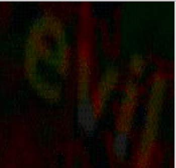

#### Problem 12

The specific part of the url is `evil`:  [link](http://www.pythonchallenge.com/pc/return/evil.html)

which returns this image:


There isn't much more in the source.  The faces of the cards look like they have 180 degree rotational symmetry.  (The disussion says this symbol is the letter "5".  I don't think so!)

So it seems like all we have to work with is the image and the title.  Does "dealing evil" sound like a Python module?

I search the web yet again.  Notice that the image is not ``evil.jpg`` but `evil1.jpg`.  The url of the resource is:

```http://www.pythonchallenge.com/pc/return/evil1.jpg```

So OK.

[link2](http://www.pythonchallenge.com/pc/return/evil2.jpg)


which says, "not jpg, _.gfx".  When we substitute that into the url, we get a file.

```
http://www.pythonchallenge.com/pc/return/evil2.gfx
```

I couldn't find a module name that sounds like "dealing evil."  The first 8 bytes in the file are `ff 89 47 89 ff d8 50 49` which doesn't match any file type in [wikipedia](https://en.wikipedia.org/wiki/List_of_file_signatures).  

Searching on the `gfx` suffix gives [this](http://extension.nirsoft.net/gfx) and [this](https://fileinfo.com/extension/gfx).

[link3](http://www.pythonchallenge.com/pc/return/evil3.jpg) 

```
http://www.pythonchallenge.com/pc/return/evil3.jpg
```

tells us not to look for more evil.

And then I notice:  `png` starts with `89 50 4E 47`.

```
> hexdump -C evil2.gfx
00000000  ff 89 47 89 ff d8 50 49  50 d8 ff 4e 46 4e ff e0  |..G...PIP..NFN..|
00000010  47 38 47 e0 00 0d 37 0d  00 10 0a 61 0a 10 4a 1a  |G8G...7....a..J.|
```

* `b[1]` is `89`
* `b[6]` is `50`
* `b[11]` is `4e`
* `b[16]` is `47`

So if we grab every fifth byte starting with `1` we may get a png file!

```
>>> fn = 'evil2.gfx'
>>> fh = open(fn, 'rb')
>>> data = fh.read()
>>> L = list(data)
>>> rL = list()
>>> for i in range(1,len(L),5):
...     rL.append(L[i])
... 
>>> rL[:5]
['\x89', 'P', 'N', 'G', '\r']
>>> fh = open('out.png', 'wb')
>>> fh.write(''.join(rL))
>>> 
```

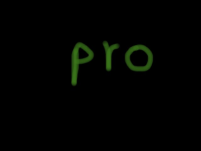

`pro` by itself does not work:  [link](http://www.pythonchallenge.com/pc/return/pro.html)

Is `ff 50` a magic byte sequence?  

* `ff d8` = jpg
* `89 50` = png
* `47 49` = gif
* `89 50` = png
* `ff d8` = jpg

So we have 5 files, with those types.

```
```

The resulting images say:

* dis
* pro
* port
* [blank]
* ity with a strike-through

I happened to try:

```
http://www.pythonchallenge.com/pc/return/disproportional.html
```

[link](http://www.pythonchallenge.com/pc/return/disproportional.html)

and it seems to work:


The discussion says "The fourth image may not load in all PNG viewers".  No shit.

#### Problem 12

The specific part of the url is `disproportional`:  [link](http://www.pythonchallenge.com/pc/return/disproportional.html)

The text says:  "phone that evil".

The title is "call him".

The page source is

```
<html>
<head>
  <title>call him</title>
  <link rel="stylesheet" type="text/css" href="../style.css">
</head>
<body>
<center>

	<map name="evil">
		<area shape="circle" coords="326,177,45" href="../phonebook.php" />
	</map>
<font color="gold"/>
<br><b>
	phone that <remote /> evil
</br>
</html>

```

From the source, it appears there is a clickable area that would call `phonebook.php`.

Indeed, clicking on 5 seems to do the trick.


`http://www.pythonchallenge.com/pc/phonebook.php`

gives (lost the formatting)

```

<methodResponse>
<fault>
<value>
<struct>
<member>
<name>faultCode</name>
<value>
<int>105</int>
</value>
</member>
<member>
<name>faultString</name>
<value>
<string>
XML error: Invalid document end at line 1, column 1
</string>
</value>
</member>
</struct>
</value>
</fault>
</methodResponse>
```
A screenshot looks better

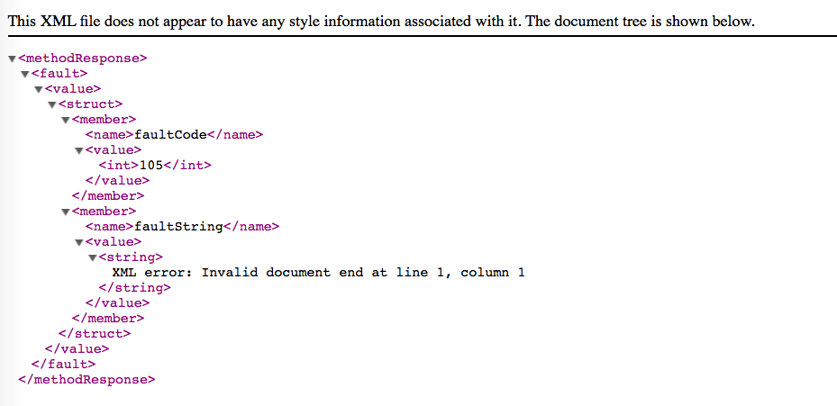

but basically this is just the browser telling us that we did something wrong.

Maybe try logging in first?  Doesn't help.

The source also has:

`phone that <remote /> evil`

What is that about?  I search the web (again, 4th time).  

```
http://www.intelligentgeek.com/home/blog/pythonchallenge13
```

They suggest `xmlrpc` (remote procedure call).

A further important clue is that there is apparently another evil file:

```
http://www.pythonchallenge.com/pc/return/evil4.jpg
```
but it's not a jpg.  Safari chokes.

I go ahead and use the info from the hint:

```
import xmlrpclib

url = 'http://www.pythonchallenge.com/pc/phonebook.php'
server = xmlrpclib.Server(url)

#print server.system.listMethods()

'''
['phone', 'system.listMethods', 'system.methodHelp', 'system.methodSignature', 'system.multicall', 'system.getCapabilities']
>
'''
```

We're getting somewhere.  `phone` is a method.


```
# result = server.phone()
# gives an error: needs parameter(s)

# print server.system.methodSignature('phone')
''' 
> python 13.py 
[['string', 'string']]
>
'''
```

This says that you pass a string in and get a string back.

```
#print server.phone('evil')

'''
> python 13.py 
He is not the evil
> 
'''
```

Better, but not there yet.  I use the rest of the hint:

```
print server.phone('Bert')
'''
> python 13.py 
555-ITALY
>
'''
```

```http://www.pythonchallenge.com/pc/return/ITALY.html```

returns

```
SMALL letters.
```

```http://www.pythonchallenge.com/pc/return/italy.html```


#### Interlude

Before we go on, I need to solve the problem of `evil4` and `Bert`.

The claim is that

```
http://www.pythonchallenge.com/pc/return/evil4.jpg
```

returns a file that is just plain text (not jpg).  Safari just gives me the WTF symbol:

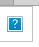

`load_url.py` gives me 401: Unauthorized.

I give up and look at the discussion of this problem.  It is not illuminating except to say that they use Firefox.

Firefox does things that Safari doesn't!  Instead of a 401, I get the login request and authenticate with `un=huge, pw=file`.

Instead of displaying a jpg, I get this error message:

```
The image "http://www.pythonchallenge.com/pc/return/evil4.jpg" 
cannot be displayed because it contains errors.
```

Firefox allows me to download `evil4.jpg`.

```
> cat evil4.jpg 
Bert is evil! go back!
>
```

So the basic problem is that I wasn't using Firefox and wasn't smart enough to tell Safari to save the file when it told me WTF!

#### Problem 14

The specific part of the url is `italy`:  [link](http://www.pythonchallenge.com/pc/return/italy.html)


 
There is something funny on the bottom of the page.

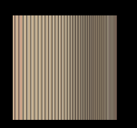

I am not quite sure how that gets displayed.  When I get the file myself, it does not display as a png though the source looks reasonable...

```
> hexdump -C -n 64 wire.png
00000000  89 50 4e 47 0d 0a 1a 0a  00 00 00 0d 49 48 44 52  |.PNG........IHDR|
00000010  00 00 27 10 00 00 00 01  08 02 00 00 00 f7 bc 23  |..'............#|
00000020  5c 00 00 3e 07 49 44 41  54 78 9c bc bd 49 8f 65  |\..>.IDATx...I.e|
00000030  49 96 1e 76 ec d8 74 a7  77 df e4 ee 31 65 54 0e  |I..v..t.w...1eT.|
00000040
> 
```

I figure out the reason for this.  The downloaded file has dimensions `10000 x 1` while the page source says its dimensions are `100 x 100`.

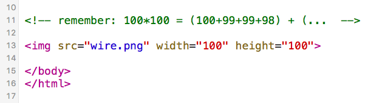


The title is "walk around."

The source (above) has:

```
<!-- remember: 100*100 = (100+99+99+98) + (...  -->
```

The formula looks a little funny with the repetition of `99`:  `(100+99+99+98)`

and no explicit statement of the second term.  I just guess:

```
n = 100
count = 0
while n > 0:
    sub = n + 2*(n-1) + n-2
    count += sub
    n -= 2

print count
```

prints `10000`.  Bingo.  And the explanation is:

```
100 + 2(99) + 98
            + 98 + 2(97) + 96
                         + 96 + 2(95) + 94 ...

```
so this is twice the sum `1..99` plus `100` which matches the formula `n(n+1)/2`.

```
n = 99
n(n+1) = 9900
```

Therefore, the second term is `(98+97+97+96)` and the last term is `(2+1+1+0)`.

I don't get anywhere by substituting in the url.

```
from PIL import Image
import numpy as np

im = Image.open('wire.png')
print im.size
im2 = im.resize((100,100))
print im2.size
im2.save('wire2.png')
```


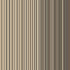

Yep.

So we have these facts:
 
* the clue: "walk around"
* the formula:  `sum 1..99 + 100`
* `wire.png` image file
* dimensions as served `10000 x 1`

I notice that the size of the image is the same as our sum.

What would we have if we summed `100 + 2(99) + 98` etc?

We'd have 50 terms.
